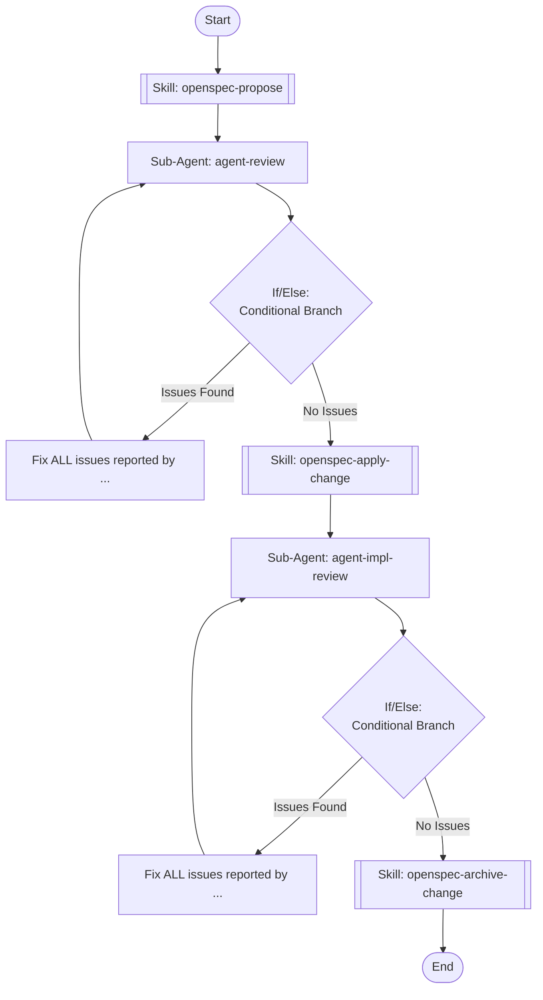

## Workflow Execution Guide

Follow the Mermaid flowchart above to execute the workflow. Each node type has specific execution methods as described below.

### Execution Methods by Node Type

- **Rectangle nodes (Sub-Agent: ...)**: Execute Sub-Agents
- **Diamond nodes (AskUserQuestion:...)**: Use the AskUserQuestion tool to prompt the user and branch based on their response
- **Diamond nodes (Branch/Switch:...)**: Automatically branch based on the results of previous processing (see details section)
- **Rectangle nodes (Prompt nodes)**: Execute the prompts described in the details section below

## Sub-Agent Node Details

#### agent-review(Sub-Agent: agent-review)

**subagent_type**: general-purpose

**Description**: Run /openspec-review in isolated context

**Prompt**:

```
Run /openspec-review to review the current OpenSpec change artifacts.

IMPORTANT: Report ALL issues regardless of severity level — including LOW level issues. Do NOT skip or ignore any issue. Every issue must be reported and treated as something that needs to be fixed.

Report the results clearly, including whether any issues were found and what they are.
```

#### agent-impl-review(Sub-Agent: agent-impl-review)

**subagent_type**: general-purpose

**Description**: Run /openspec-impl-review in isolated context

**Prompt**:

```
Run /openspec-impl-review to review the code implementation against the OpenSpec change.

IMPORTANT: Report ALL issues regardless of severity level — including LOW level issues. Do NOT skip or ignore any issue. Every issue must be reported and treated as something that needs to be fixed.

CRITICAL — 구현 중 스펙 오염 검증: 구현 과정에서 스펙 파일(proposal.md, design.md, tasks.md, specs/)에 구현 세부사항(CSS 클래스, props 인터페이스, JSON 필드명, 에러코드, 계산 공식)이 추가되었다면 반드시 지적하라. 스펙은 행위 계약으로 유지되어야 한다.

Report the results clearly, including whether any issues were found and what they are.
```

## Skill Nodes

#### skill-propose(openspec-propose)

- **Prompt**: skill "openspec-propose"

#### skill-apply(openspec-apply-change)

- **Prompt**: skill "openspec-apply-change"

#### skill-archive(openspec-archive-change)

- **Prompt**: skill "openspec-archive-change"

### Prompt Node Details

#### prompt-fix-proposal(Fix ALL issues reported by ...)

```
Fix ALL issues reported by the previous review in the OpenSpec artifact files (proposal.md, design.md, tasks.md, specs), including LOW level issues. Make minimal targeted changes to resolve each issue.

행위 계약 위반이 발견된 경우: 구현 세부사항(CSS 클래스, props 인터페이스, JSON 필드명, 에러코드, 계산 공식)은 design.md로 이동하고, 스펙에는 외부 관찰 가능한 행위만 남긴다.
예) BAD: "StatusBadge SHALL render with bg-[#e8f5e9]" → GOOD: "StatusBadge SHALL visually distinguish LIVE status"
```

#### prompt-fix-impl(Fix ALL issues reported by ...)

```
Fix ALL issues reported by the previous implementation review in the source code, including LOW level issues. Make minimal targeted changes to resolve each issue while maintaining existing functionality.
```

### If/Else Node Details

#### ifelse-review(Binary Branch (True/False))

**Evaluation Target**: Review result from openspec-reviewer

**Branch conditions:**
- **Issues Found**: Review found one or more issues to fix (any severity: HIGH, MEDIUM, or LOW)
- **No Issues**: Review passed with zero issues at all severity levels

**Execution method**: Evaluate the results of the previous processing and automatically select the appropriate branch based on the conditions above.

#### ifelse-impl(Binary Branch (True/False))

**Evaluation Target**: Impl review result from impl-reviewer

**Branch conditions:**
- **Issues Found**: Review found one or more issues to fix (any severity: HIGH, MEDIUM, or LOW)
- **No Issues**: Review passed with zero issues at all severity levels

**Execution method**: Evaluate the results of the previous processing and automatically select the appropriate branch based on the conditions above.
